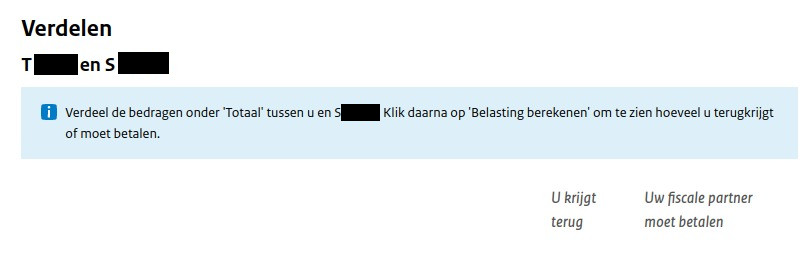
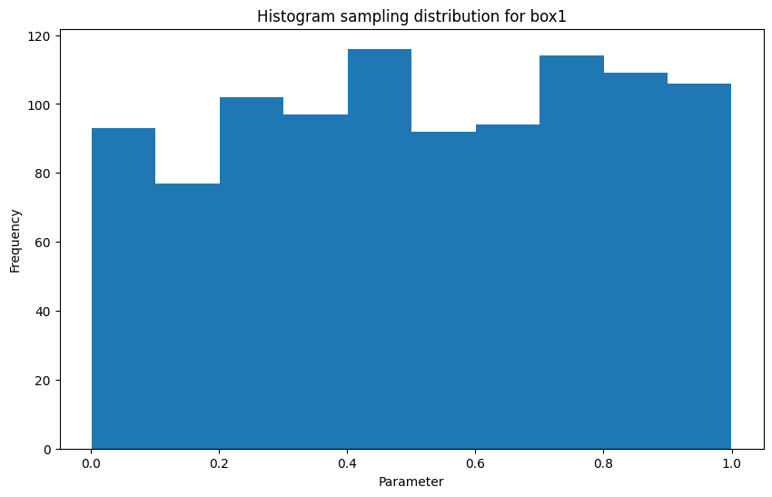
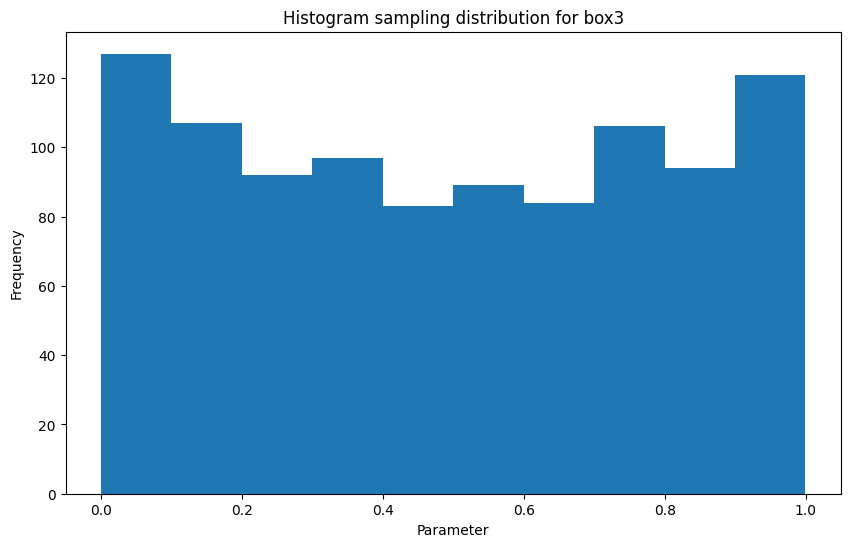
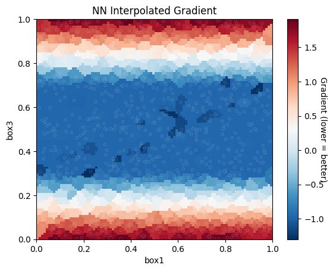
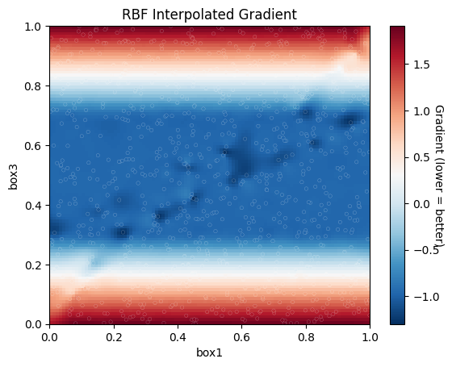

# Optimizing Income Tax Returns in the Netherlands for 2022 by Analyzing its Gradient



## DISCLAIMER

This algorithm sends thousands of requests to the belastingdienst servers over a timespan of ~1h30m. Please note that using this algorithm is at your own risk and the author takes no responsibility for any consequences resulting from the use of this algorithm. 

I recommend reducing the number of samples to minimize the load on the servers. While 1000 samples allow for more detailed analysis of the gradient, in reality the algorithm can converge to a good minima with ~100 samples for most cases.

Furthermore, please be aware that the algorithm may not find the global minimum and it may be necessary to run the algorithm multiple times with different random seeds or adjust the number of samples.

If someone wishes to develop this algorithm into a tool, please contact the author, [Sikerdebaard](https://github.com/Sikerdebaard), who is available on a freelance basis.

## 1: Introduction

In this document, we will describe an algorithm to optimize tax savings in the Dutch tax system. The algorithm makes use of a Python script that automates the process of optimizing tax savings by perturbing input parameters for box1 and box3 and calculating the gradient of the function with respect to each input parameter. The script generates a random vector of values that are sampled from a uniform distribution to perturb the input parameters.

The algorithm tests a total of 1000 random permutations to calculate the gradient by interpolating the random samples. While the algorithm is good at finding local minima, there is no guarantee that these minima are the global minima. The algorithm should be run multiple times with different random seeds or adjust the number of samples if the algorithm fails to converge or if the gradient looks flawed or incomplete.

In the following chapters, we will describe the algorithm in more detail, including the configuration parameters, the steps to run the algorithm, and the interpretation of the output.

## 2: Setting up the Environment

Before we can start using the algorithm, we need to set up the environment. This chapter will guide you through the steps required to configure your system to run the Python code.

### Prerequisites

- Python 3.8 or higher
- Required Python packages: numpy, matplotlib, selenium, tqdm, and scipy.
- Firefox browser

### Installing Python

Python is a popular high-level programming language used for a wide variety of applications. The first step in setting up the environment is to install Python 3.8 or higher on your system. The Python installation process varies depending on your operating system. You can download the latest version of Python from the official Python website.

### Installing Required Python Packages

After installing Python, you need to install the required Python packages. The required packages are numpy, matplotlib, selenium, tqdm, and scipy. You can install these packages using pip, which is the package installer for Python. Run the following command to install the required packages:

```bash
pip3 install numpy matplotlib selenium tqdm scipy
```

### Installing Firefox

The algorithm uses the Firefox browser to interact with the Belastingdienst website. You can download and install the latest version of Firefox from the official Firefox website.

## 3: The Algorithm

The algorithm to sample the gradient aims to calculate the gradient of the function with respect to each input parameter for box1 and box3 by randomly perturbing their values. The algorithm generates a random vector of values that are sampled from a uniform distribution to perturb the input parameters. The algorithm then tests a total of 1000 random permutations to calculate the gradient by interpolating the random samples.

Although there are many methods to achieve a similar result for this problem, the random sampling method was selected because manual joint posts optimization on the website feels like spinning the wheel of fortune. It's not feasible to check every possible permutation to find the optimal result, so the random sampling method provides a good balance between accuracy and feasibility while also staying close to how the website originally is intended to work.

It's important to note that there is still a risk that the algorithm may not find the global minimum. In such cases, it may be necessary to run the algorithm multiple times with different random seeds or adjust the number of samples to find the optimal solution. This algorithm is good at finding local minima, but there's no guarantee that these minima are the global minima. Therefore, it's recommended to run the algorithm more than once if it fails to converge or if the gradient looks flawed or incomplete.


## 4: Using the Algorithm

Now that we have covered the details of the algorithm, we can discuss how to use it to optimize your tax savings. 

### Step 1: Set the Input Parameters

You will need to set the input parameters for box1 and box3. These can be found on the website of the Belastingdienst, which you will need to navigate to manually. Once you have reached the "Verdeel de bedragen" page, you can open the developer tools in your browser to inspect the input fields for box1 and box3.

Next you will need to enter these input parameters in the `config` dictionary located in the Python script. Specifically, you will need to update the `input_params` dictionary with the correct IDs for each input field. You can do this by inspecting the HTML source code for the input fields.


```python
# config params to change when the belastingdienst page is changed

config = {
    'input_params': {
        'box1': {
            'eltotal': ['id', 'verdeeloptimaalinvoer_verdeeloptimaalinvoer1_invfmbx1ewtotafteigenwongez'],
            'elinput': ['id', 'verdeeloptimaalinvoer_verdeeloptimaalinvoer1_verdeelewaang'],
        },
        'box3': {
            'eltotal': ['id', 'verdeeloptimaalinvoer_verdeeloptimaalinvoer1_invfmbx3gezgrdslgez'],
            'elinput': ['id', 'verdeeloptimaalinvoer_verdeeloptimaalinvoer1_verdeelbox3aang'],
        },
    },
    'berekenbutton': ['xpath', '//button[@title="Belasting berekenen"]'],
    'resultfield': ['xpath', "//*[contains(text(), 'Te betalen')]"],
    'num_samples': 1_000,
}
```


```python
# imports
import numpy as np
import matplotlib.pyplot as plt

from selenium.webdriver import Firefox
from selenium.webdriver.firefox.options import Options
from selenium.webdriver.common.by import By
from selenium.common.exceptions import NoSuchElementException
from selenium.webdriver.common.keys import Keys

from tqdm.auto import tqdm

from scipy.interpolate import NearestNDInterpolator, RBFInterpolator
from scipy.stats import zscore
from scipy.optimize import minimize

import time
```


```python
# util functions

def toint(s):
    return int(s.replace('.', '').replace(',','.'))


def set_input(el, inp):
    el.send_keys(Keys.CONTROL + "a")
    el.send_keys(inp)
    el.send_keys(Keys.TAB)
    time.sleep(1)
```

### Step 2: Run the Algorithm

Once you have set the input parameters, you can run the algorithm by executing the following code. The code will open a Firefox browser window and navigate to the belastingdienst website where you will have to login and navigate to the "verdeel" page of the Belastingdienst website.


```python
# initialize an instance of Firefox with selenium
# and wait for the user to go to the verdelen page

options = Options()
driver = Firefox(options=options)

driver.get('https://mijn.belastingdienst.nl/mbd-pmb/pmb.html')

is_aangifte_page = lambda driver: 'aangifte' in driver.current_url and '2022' in driver.current_url and 'olaib.html' in driver.current_url
    
while not is_aangifte_page(driver):
    time.sleep(1)
    
time.sleep(1)


while 'Verdeel de bedragen' not in driver.page_source:
    time.sleep(1)
    
time.sleep(1)


# retrieve the box1/box3 parameters that we need to optimize
enabled_params = []
totparams = {}
for k, v in config['input_params'].items():
    try:
        el = driver.find_element(*v['eltotal'])
        totparams[k] = toint(el.get_attribute('innerText'))
        enabled_params.append(k)
    except NoSuchElementException as e:
        print(f'WARN: Element not found: {k} {v["eltotal"]}')
    
print(f"Found the following params on page: {', '.join(enabled_params)}")
```

    Found the following params on page: box1, box3


The algorithm will then generate 1000 random permutations of the input parameters for box1 and box3, and calculate the tax savings for each permutation. The algorithm will output the best permutation and the corresponding tax savings. Running this step will take around 1h so be patient.


```python
num_params = len(enabled_params)
num_samples = config['num_samples']

samples = np.random.uniform(0, 1, (num_samples, num_params))

print('Distribution parameters')

for idx in range(samples.shape[1]):
    plt.figure(figsize=(10, 6))
    plt.hist(samples[:, idx], bins=10)
    plt.title(f'Histogram sampling distribution for {enabled_params[idx]}')
    plt.ylabel('Frequency')
    plt.xlabel('Parameter')
```

    Distribution parameters


    

    


    

    


```python
def calc(samples):
    for param_idx, param in zip(range(len(enabled_params)), enabled_params):
        elinp = driver.find_element(*config['input_params'][param]['elinput'])
        perc = samples[param_idx]
        set_input(elinp, f'{int(totparams[param] * perc)}')
    
    driver.find_element(*config['berekenbutton']).click()
    time.sleep(1)

    betalen = toint(driver.find_element(*config['resultfield']).get_attribute('innerText').split('€')[-1].strip())
    return betalen


results = []
for idx in tqdm(range(samples.shape[0])):
    betalen = calc(samples[idx, :])
    results.append(betalen)
```


      0%|          | 0/1000 [00:00<?, ?it/s]


```python
# visualize the gradient based on the random samples

def visgrad(xy, z, interpolator, title, labels, interparams=None):
    if interparams is None:
        interparams = {}
    
    edges = np.linspace(0., 1., 101)
    centers = edges[:-1] + np.diff(edges[:2])[0] / 2.

    x_i, y_i = np.meshgrid(centers, centers)
    x_i = x_i.reshape(-1, 1)
    y_i = y_i.reshape(-1, 1)
    xy_i = np.concatenate([x_i, y_i], axis=1)


    interp = interpolator(xy, z, **interparams)
    z_i = interp(xy_i)

    # plot the result
    fig, ax = plt.subplots()

    X_edges, Y_edges = np.meshgrid(edges, edges)
    
    # Use red-white-blue colorpallet
    # Because they resemble the colors of the Dutch flag
    lims = dict(cmap='RdBu_r', vmin=z.min(), vmax=z.max())

    mapping = ax.pcolormesh(
        X_edges, Y_edges, z_i.reshape(100, 100),
        shading='flat', **lims
    )

    ax.scatter(xy[:, 0], xy[:, 1], 10, z, edgecolor='w', lw=0.1, **lims)
    ax.set(
        title=title,
        xlim=(0., 1.),
        ylim=(0., 1.),
    )
    
    plt.xlabel(labels[0])
    plt.ylabel(labels[1])

    cbar = fig.colorbar(mapping)
    cbar.ax.set_ylabel('Gradient (lower = better)', rotation=270)
    
    
# convert the amount to pay into zscore
# because I do not feel comfortable putting
# my box1/box3 numbers out in public
zresults = zscore(results)

# sort in descending order - this improves
# the matplotlib render because the lowest
# values are drawn last
sortidx = np.argsort(-np.array(zresults))

sorted_samples = samples.copy()[sortidx, :]
sorted_results = np.array(zresults)[sortidx]

# Visualize the found gradient using a NN and RBF Interpolator
visgrad(sorted_samples, sorted_results, NearestNDInterpolator, 'NN Interpolated Gradient', enabled_params)
visgrad(sorted_samples, sorted_results, RBFInterpolator, 'RBF Interpolated Gradient', enabled_params, {'epsilon': 2})
```


    

    


    

    


### Step 3: Repeat if Necessary

If the algorithm does not converge or the results seem incomplete, it may be necessary to run the algorithm again with different random seeds or adjust the number of samples. Additionally, since the algorithm only finds local minima, it is possible that running the algorithm multiple times may lead to finding better global minima.

### Step 4: Further optimizations

To achieve even better results, we can run the `scipy.optimizer.minimize` function with the Nelder-Mead method on the top-10 results of the random search. This method can potentially find a slightly better local minimum, resulting in a slightly more favorable tax return. However, it should be noted that the improvement in tax return is usually only a few euros as compared to the random search. 

Running this optimizer may take around 30 minutes to complete.


```python
topx = 10
topx_samples = sorted_samples[-topx:]

topx_samples
```


    array([[0.61531882, 0.49957794],
           [0.01576227, 0.3059304 ],
           [0.8202811 , 0.60858487],
           [0.57517845, 0.48116082],
           [0.79867884, 0.71192341],
           [0.33883943, 0.36108678],
           [0.94054974, 0.67566831],
           [0.54706741, 0.57575385],
           [0.44949658, 0.42126156],
           [0.22953166, 0.30790854]])


```python
# Run the scipy minimizer

method = 'Nelder-Mead'
options = {
    #'disp': True, 
    'return_all': True,
}

minimizer_results = []
bounds = [
    (0, 1) for i in range(2)
]

for sample in tqdm(topx_samples[::-1]):
    res = minimize(calc, np.array(sample), method=method, bounds=bounds, options=options)
    minimizer_results.append(res)
```


      0%|          | 0/10 [00:00<?, ?it/s]


### Step 5: Print the results

In the final step, the results from the successful optimizers are printed. The optimizers should have converged to a local minima. The printed result is the value of the lowest found minima that saves the most money. 


```python
success = [x for x in minimizer_results if x.success]
fun = [x.fun for x in success]
idxmin = fun.index(min(fun))
winning_sample = success[idxmin].x

for idx, param in zip(range(len(enabled_params)), enabled_params):
    perc = winning_sample[idx]
    
    left = int(totparams[param] * perc)
    right = int(totparams[param] - left)
    print(f'{param} Uw deel: {left} Partner: {right}')
print(f'Te betalen: €{int(fun[idxmin])}')
print(f'Verschil tussen min en max: €{max(results) - int(fun[idxmin])} max: {max(results)} min: {int(fun[idxmin])}')
```

    box1 Uw deel: xxx Partner: yyy
    box3 Uw deel: xxx Partner: yyy
    Te betalen: €xxx
    Verschil tussen min en max: €xxx max: yyy min: zzz


## 5: Conclusion and Future Work

In this project, we have presented an algorithm to optimize tax savings by perturbing the input parameters for box1 and box3 of the Dutch tax system. The algorithm uses random sampling to approximate the gradient of the tax function with respect to each input parameter. 

We have demonstrated that this approach can find good local minima, but there is no guarantee that the algorithm will find the global minimum. We recommend running the algorithm multiple times with different random seeds or adjusting the number of samples to improve the chances of finding a good solution. 

Future work could include improving the sampling method, exploring other optimization algorithms, or expanding the scope of the problem to include other tax categories. Additionally, the algorithm could be integrated into a web application to provide a user-friendly interface for taxpayers to optimize their tax savings. 

In summary, this project presents an effective and efficient method for optimizing tax savings in the Dutch tax system. The algorithm can provide significant benefits for taxpayers, and we look forward to further developments in this field.
